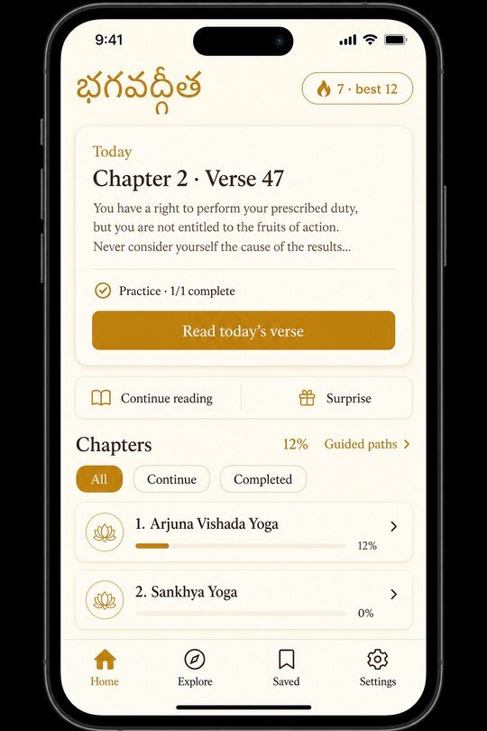
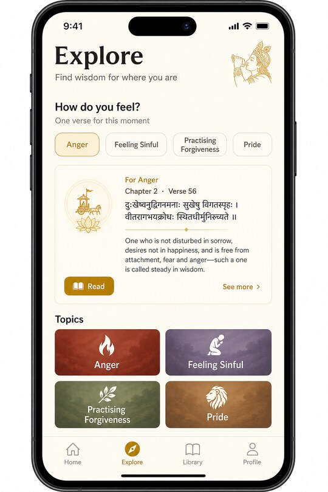
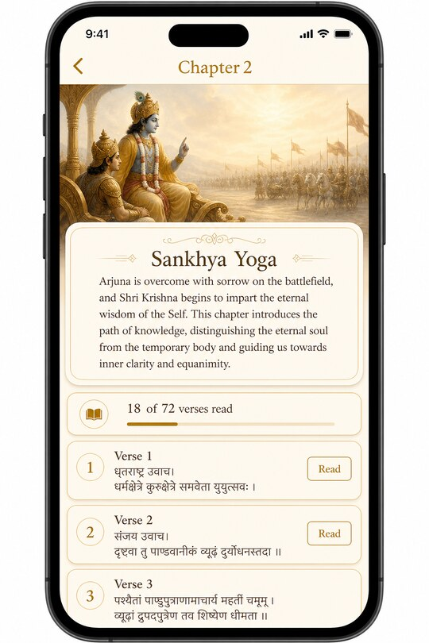
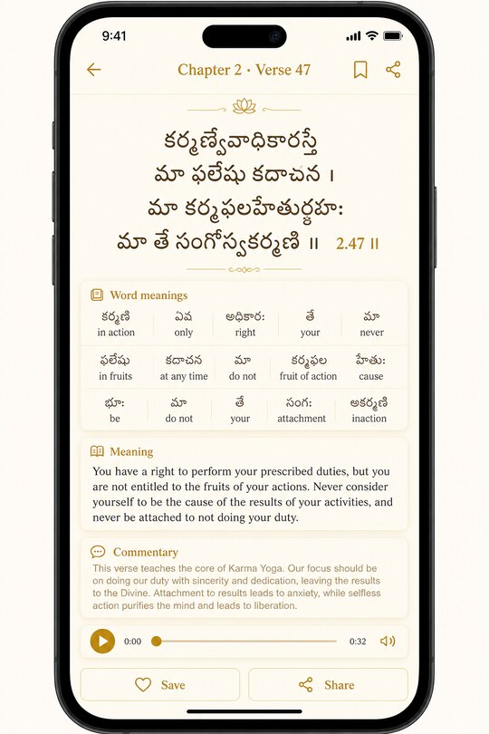
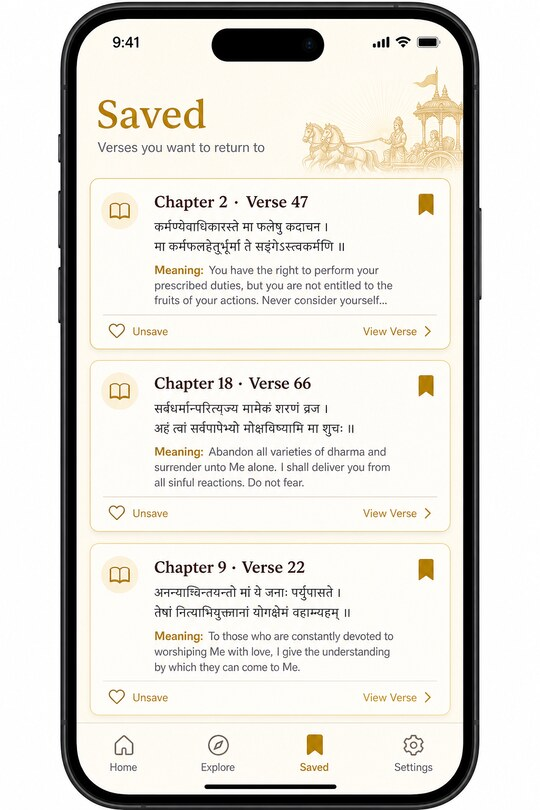
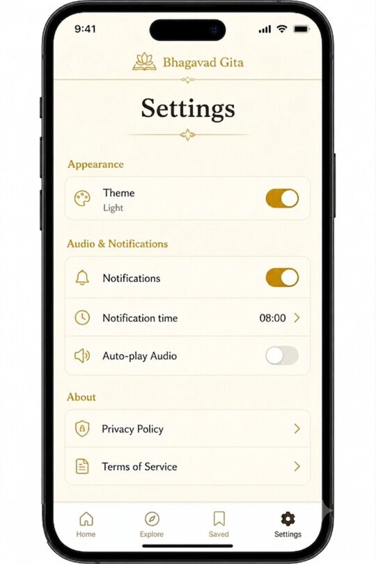

# Bhagavad Gita App

A polished Bhagavad Gita reading experience built with Expo + React Native, designed for daily practice, guided exploration, and smooth scripture study.

## App preview

<p align="center">
  
  
  
</p>
<p align="center"><em>Home · Explore · Chapter</em></p>

<p align="center">
  
  
  
</p>
<p align="center"><em>Verse · Saved · Settings</em></p>

## Why this app

This project focuses on three outcomes:
- **Consistency:** daily reminders, streaks, and progress tracking.
- **Clarity:** chapter/verse browsing with readable layouts and contextual meaning.
- **Delight:** tactile interactions, share cards, audio support, and themed UI.

## Highlights

- Full chapter and verse reading flow (18 chapters)
- Daily verse reminders with customizable time
- Verse save/unsave and dedicated Saved tab
- Explore by life-topic categories with verified verse mapping
- Verse detail with sloka, word meanings, meaning, commentary, and audio
- Share card image generation for social sharing
- Reading streak + chapter/overall progress tracking
- Surprise verse modal and continue-reading shortcut
- Android home-screen daily verse widget (+ iOS data bridge stub)
- Guided reading paths and offline-first progress

## Tech stack

- **Framework:** Expo SDK 54, React Native 0.81, React 19
- **Navigation:** Expo Router
- **UI:** React Native Paper, Reanimated, Gesture Handler, Haptics
- **Persistence:** AsyncStorage
- **Notifications:** `expo-notifications` (rolling 7-day local DATE schedules)
- **Sharing:** `react-native-view-shot`, `expo-sharing`, `expo-file-system`
- **Native bridge:** Kotlin/Swift widget data modules

## Agent / contributor docs

For AI agents and humans orienting in the codebase:

- [`AGENTS.md`](AGENTS.md) — stack map, conventions, feature touchpoints
- [`.cursor/rules/`](.cursor/rules/) — Cursor rules (core, UI theme, verse data)
- [`.cursor/skills/`](.cursor/skills/) — task skills (UI polish, verse content, practice systems)

## Feature walkthrough

### Home
- Telugu title header + dynamic streak chip
- Continue reading shortcut (from last read verse)
- Surprise modal for random verse discovery
- Per-chapter progress cards with filter chips (`All`, `Continue`, `Completed`)

### Explore
- Category tiles for thematic discovery
- “Today’s Verse” surface with quick CTA
- Category detail cards showing verse text and read state

### Chapter
- Hero chapter art and context card
- Chapter progress summary
- Full verse cards with clear open affordance
- Read badge and state-aware styling

### Verse detail
- Sloka, word meanings, meaning, commentary
- Audio playback support (with settings-based autoplay)
- Save/unsave + share
- Swipe navigation to previous/next verse
- Long-press copy interactions

### Saved
- Dedicated saved verse list
- Quick unsave directly from each card
- Empty-state CTA to continue browsing chapters

### Settings
- Theme toggle
- Notification toggle + custom daily time picker
- Notification status visibility (next reminder time)
- Auto-play audio toggle
- Reading progress reset

## Notifications model

Notifications are implemented as a **rolling window of one-shot DATE notifications**:
- Schedules the next 7 days at the selected time
- Each day's tray text includes that day's verse preview
- Re-schedules on app foreground / preference changes
- Notification tap opens the verse for the tapped day (or today's verse)

Implementation references:
- `lib/daily-verse-notifications.ts`
- `lib/daily-verse.ts`
- `app/_layout.tsx`

### Expo Go limitation (Android)

`expo-notifications` cannot be required in Expo Go Android for this setup.  
Use a **development build** for notification testing on Android.

Reference: `lib/notification-availability.ts`

## Widgets

- **Android:** AppWidget provider and native module are shipped.
  - `android/app/src/main/java/com/jathinshyam/BagavadGita/DailyVerseWidgetProvider.kt`
  - `android/app/src/main/java/com/jathinshyam/BagavadGita/WidgetDataModule.kt`
- **iOS:** `WidgetDataModule.swift` is a storage bridge stub only (no widget extension / App Group yet).

Widget data is pushed from app lifecycle in `app/_layout.tsx`.

## Project structure

```text
app/                              # Expo Router — routes only
  _layout.tsx                     # Root stack (providers, onboarding gate)
  onboarding.tsx                  # First-run flow
  (main)/                         # Tab navigator (route group)
    index.tsx                     # Home — chapter list (/)
    explore/
      index.tsx                   # Explore topic grid (/explore)
      [categoryId].tsx            # Category verse list (/explore/:id)
    saved.tsx                     # Saved verses (/saved)
    settings.tsx                  # App settings (/settings)
  chapters/[chapterId].tsx        # Chapter detail (/chapters/:id)
  verses/[verseId].tsx            # Verse detail (/verses/:id)
constants/routes.ts               # Typed route path builders
components/
  ui/                             # ErrorBoundary, EmptyState, SkeletonLoader, Toast
  modals/                         # CelebrationModal, SurpriseVerseModal
  verse/                          # VerseAudioPlayer, ShareCard
context/
  theme-context.tsx               # Light/dark theme provider
  reading-progress-context.tsx    # Reading progress and streak state
constants/
  app-urls.ts                     # Privacy policy and terms URLs
  chapter-images.ts               # Chapter hero image assets
  chapter-summaries.ts            # Home screen chapter list
  chapter-verse-counts.ts         # Verse counts per chapter
  storage-keys.ts                 # AsyncStorage key names
  verse-sequences.ts              # Verse navigation order per chapter
data/
  explore-categories.ts           # Explore tab topic categories
  chapters/chapter-details.ts     # Full chapter metadata and descriptions
  verses/
    verse-catalog.ts              # All verses and lookup helpers
    verse-audio.ts                # Audio file resolution
    audio-mapper.ts               # Verse-to-MP3 asset map
    chapters/chapter-01.ts …      # Verse content per chapter
hooks/                            # useAppTheme, useReadingProgress, useColorScheme
lib/
  daily-verse.ts                  # Daily verse selection logic
  daily-verse-notifications.ts    # Local notification scheduling
  notification-availability.ts    # Expo Go notification guards
  verse-id-registry.ts            # Valid verse ID set for tests
  widget-data.ts                  # Native widget data bridge
services/verse-share.tsx          # Share-card image capture and export
theme/
  design-tokens.ts                # Colors, spacing, radius palette
  screen-styles.ts                # Shared StyleSheet definitions
types/                            # Shared TypeScript interfaces
android/                            # Native Android project
ios/                              # Native iOS project
docs/                             # Public legal pages (privacy/terms)
__tests__/                        # Automated tests
```

## Getting started

### Prerequisites

- Node.js LTS
- npm
- Android Studio and/or Xcode (for native simulator/emulator workflows)

### Install dependencies

```bash
npm install
```

### Start the app

```bash
npm run start
```

### Run on specific platforms

```bash
npm run android
npm run ios
npm run web
```

## Scripts

- `npm run start` - Start Expo dev server
- `npm run android` - Build/run Android app
- `npm run ios` - Build/run iOS app
- `npm run web` - Run web target
- `npm run lint` - Run lint checks
- `npm run test` - Run Jest tests

## Quality and testing

- Category verse mapping integrity is covered by:
  - `__tests__/category-verse-ids.test.ts`
- Linting is configured via Expo ESLint
- Core UX and stability issues were addressed in-app (error boundary, timer cleanup, notification handling, accessibility, and verse mapping checks).

## Troubleshooting

### Worklets/Reanimated mismatch after upgrades

If you see an error like:
- `[Worklets] Mismatch between JavaScript part and native part ...`

this usually means JS dependencies changed but your native binary was not rebuilt.

Quick recovery:

```bash
npm install
npx expo start --clear
```

Rebuild native app when:
- Expo SDK version changes
- `react-native-reanimated` or `react-native-worklets` versions change
- mismatch errors persist after cache clear

Rebuild commands:

```bash
npx expo prebuild --clean
npx expo run:android
```

or:

```bash
eas build --profile development
```

### Notifications do not appear on Expo Go (Android)

This is expected for this setup. Use a development build for Android notification testing.

## Pre-publish checklist

Before shipping to stores:

- Enable GitHub Pages for `/docs` so policy URLs are reachable.
- Update “Last updated” text in `docs/privacy.html` and `docs/terms.html`.
- Ensure release signing is configured (`eas credentials`) and do not ship debug-signed builds.
- Confirm app URLs in `constants/app-urls.ts`.
- Rebuild release binaries after config/plugin changes.

Recommended release build:

```bash
eas build --platform all --profile production
```

## Security and policy links

Configured in `constants/app-urls.ts`:
- Privacy Policy: <https://jathinshyam.github.io/BagavadGitaApp/privacy.html>
- Terms of Service: <https://jathinshyam.github.io/BagavadGitaApp/terms.html>
